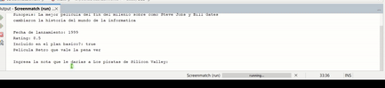

# Evaluación de Películas - Java

Este es un proyecto en Java que permite calcular la media de las evaluaciones de una película basada en las calificaciones ingresadas por los usuarios.

## Funcionalidades
- Muestra información básica de la película.
- Permite a los usuarios ingresar calificaciones.
- Calcula la media de las calificaciones usando un ciclo `while`.

## Requisitos
- Java 17 o superior.

## Debido a la mala calidad del gif, estos son los datos que se muestran en el gif
run:
Pelicula: Los piratas de Silicon Valley
Sinopsis: La mejor pelicula del fin del milenio sobre como Steve Jobs y Bill Gates
cambiaron la historia del mundo de la informatica

Fecha de lanzamiento: 1999
Rating: 8.5
Incluido en el plan basico?: true
Pelicula Retro que vale la pena ver

Ingresa la nota que le darias a Los piratas de Silicon Valley:
9
Ingresa la nota que le darias a Los piratas de Silicon Valley:
8.5
Ingresa la nota que le darias a Los piratas de Silicon Valley:
9.5
Ingresa la nota que le darias a Los piratas de Silicon Valley:
8.2
Ingresa la nota que le darias a Los piratas de Silicon Valley:
8
La media de la pelicula Los piratas de Silicon Valley calculada por el usuario es: 8.64
BUILD SUCCESSFUL (total time: 24 seconds)
